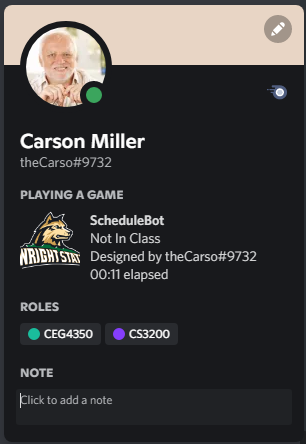

# ScheduleBot

*ScheduleBot* is a Python program that uses the Discord Rich Presence API to automatically show courses as a Discord status.

**Requirements:**

* pypresence: `pip install pypresence`
* A [Discord developer application](https://discord.com/developers/applications)
	* Your application's *client id*, which can be obtained under the OAuth2 tab

**Setup**

1. Enter your client ID in the options.txt file, under the *clientid* section
2. Replace the classes in the options.txt with your classes
3. Run `main.py`

**Icon Setup**

* To add an icon to your status, upload it to the Rich Presence Assets in your Discord Developer Application, with the id `icon`.